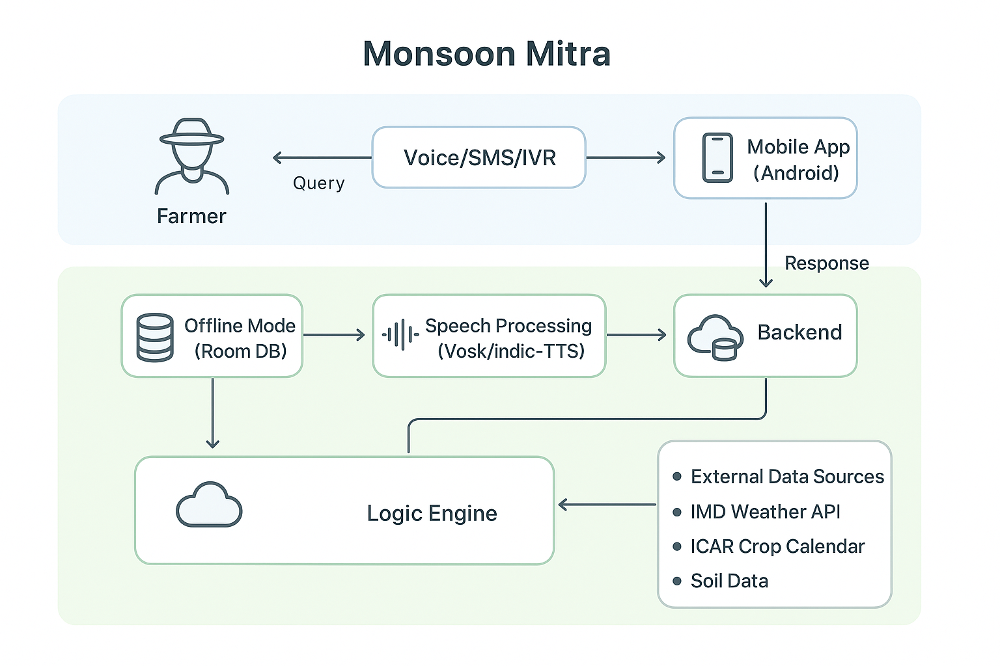
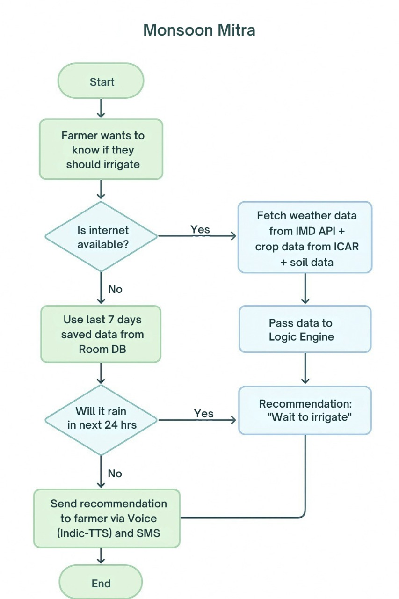

# 🌾 Monsoon Mitra – Smart Irrigation Advisor for Farmers

> “Monsoon Mitra is a farmer’s friend who never sleeps — giving weather‑aware irrigation advice in local languages, even without internet.”

I come from a farming family. I’ve seen how one sudden rain can waste water, money and time — or how skipping water at the wrong time can hurt the crop. Monsoon Mitra is built farmer‑first to make irrigation decisions simple, in Hindi by default, with a lightweight, offline‑ready web app.

🔗 Live Demo: https://monsoonmitra.vercel.app

---

## ✨ Features at a glance

- 📡 Live weather (Open‑Meteo) + offline cache (PWA)
- 🤖 AI Sahayak (Gemini) – speak/type in Hindi/English/Hinglish
- 🔊 Hindi Text‑to‑Speech for answers (farmer can listen)
- 🌦️ 7‑day forecast, rainfall bars, temp labels
- 💧 Recommendation logic – wait/irrigate based on probability & mm
- ⚠️ Emergency alerts – flood, drought, harvest‑risk (next 72h)
- 👨‍🌾 Farmer‑friendly UI – green/amber, big touch targets, leaf textures
- 🏷️ Multilingual: Hindi (default), English, Bengali, Marathi, Punjabi
- 💰 Savings tracker – skip irrigation → rupees saved
- 📱 PWA installable – works on low‑end Androids, offline first

---

## 📐 Architecture



---

## 🧭 Flowchart



---

## 🛠 Tech Stack

- Frontend: React + Vite + Tailwind CSS
- State: React Hooks + localStorage caches
- Weather: Open‑Meteo (hourly + daily) with SW stale‑while‑revalidate
- AI: Google Gemini (text) via fetch + local Q/A history & favorites
- Voice: Web Speech API (STT + TTS Hindi); graceful fallback to typing
- PWA: Service Worker + manifest + offline banner

---

## 🚀 Getting Started (Local)

```bash
# 1) Clone
git clone https://github.com/MSAbhishek22/Monsoon_Mitr.git
cd Monsoon_Mitr

# 2) Install
npm install

# 3) Configure environment
# create .env and add your Gemini key (never commit)
echo VITE_GEMINI_API_KEY=your_key_here > .env

# 4) Run dev server
npm run dev
# open http://localhost:3002 (or the port shown)
```

### Build
```bash
npm run build
npm run preview
```

---

## 🔐 Environment

Create a `.env` (not committed) with:
```
VITE_GEMINI_API_KEY=your_key_here
```
Notes:
- Keys are read from `import.meta.env.*` at build time. Do not hardcode in source.
- `.env` is ignored by git.

---

## ☁️ Deploy on Vercel

Quick setup (GitHub import):
- Framework Preset: Vite
- Build Command: `npm run build` (or `vite build`)
- Output Directory: `dist`
- Install Command: `npm install`
- Env: `VITE_GEMINI_API_KEY`

Optional SPA rewrite (create `vercel.json` at repo root):
```json
{ "rewrites": [{ "source": "/(.*)", "destination": "/index.html" }] }
```

---

## 🌦️ Recommendation & Alerts (summary)

- Wait if next 24h `maxProb ≥ 50%` or `totalRain ≥ 5mm`, else irrigate
- Harvest risk (72h) — warn if `prob ≥ 40%` or `rain ≥ 2mm`
- Flood alert for very high probability; drought alert if hot and dry

---

## 🗣️ AI Sahayak

- WhatsApp‑style chat bubbles (farmer beige + green bot)
- Conclusion badge + bullet points for clarity
- History + ⭐ favorites stored locally
- 🔊 “सुनें” speaks answer in Hindi; STT supports Hindi/English/Hinglish
- Offline: if AI unreachable, generates formatted advice from cached weather

---

## 🧩 UI / Accessibility

- Earthy greens + amber; pure CSS textures (no heavy images)
- Large type and ≥56px touch targets
- Online/offline indicator; PWA install prompt

---

## 📂 Project Structure (frontend)

```
Monsoon_Mitr/
├── assets/                      # README images & assets
├── public/ (optional)           # static assets if needed
├── src/
│   ├── components/              # UI components
│   │   ├── ai/                  # AI Sahayak + providers
│   │   └── ...
│   ├── api/                     # open‑meteo + geocode provider
│   ├── state/                   # localStorage helpers
│   ├── utils/                   # tts, speech, harvest risk
│   ├── index.css                # theme + textures
│   ├── App.jsx                  # main app
│   └── main.jsx                 # Vite entry
├── service-worker.js            # PWA SW (cached + API SWR)
├── index.html                   # Vite HTML
└── ...
```

---

## 🧪 Demo data & Testing hooks

Open the browser console and try:
```js
window.forceHarvestStage()  // Set stage to Harvesting
window.fakeHighRain()       // Toggle demo high‑rain for alerts
```

---

## 🙏 Acknowledgements

- Open‑Meteo for free weather APIs
- Google Gemini for text answers
- Tailwind CSS for fast styling

---


## 📄 License

This project is licensed under the MIT License - see the LICENSE file for details.

## 🙏 Acknowledgments

- Built for Indian farmers and agricultural communities
- Inspired by the need for accessible weather information
- Designed with mobile-first, offline-first principles

---

**Made with ❤️ for farmers everywhere**
