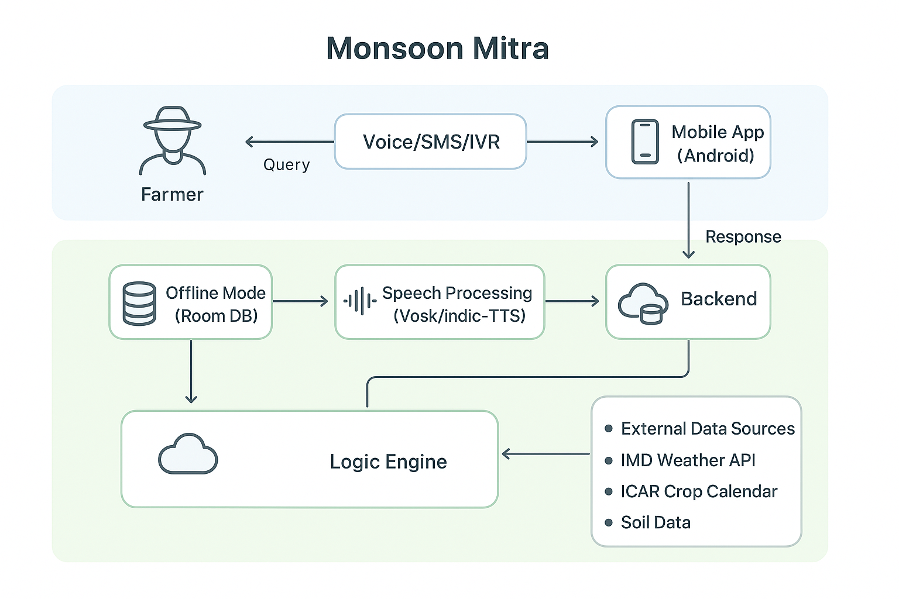
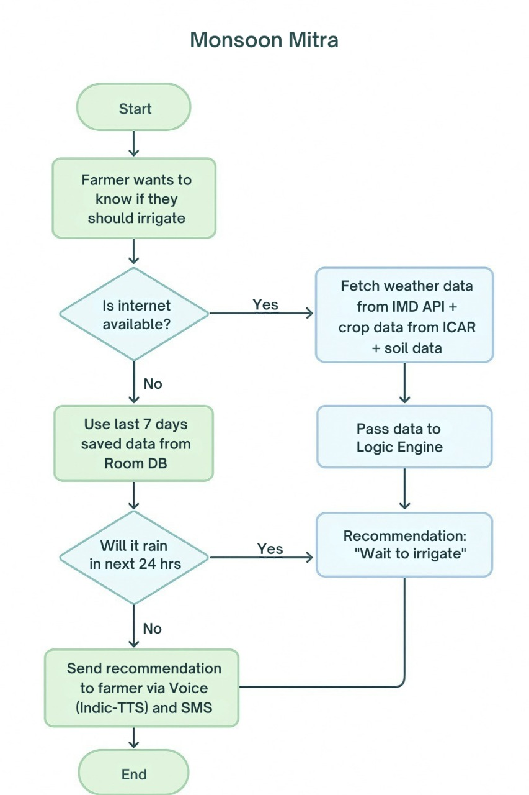

# 🌾 Monsoon Mitra – Smart Irrigation Advisor for Farmers

> **Tagline:** *Helping farmers save water, money, and crops with timely irrigation advice – even offline.*

---

## 📜 Problem Statement

Small-scale farmers in India often face crop damage and financial loss due to unpredictable rainfall.  
If it rains too early or too late, they either spend extra money on irrigation or lose crops entirely.

---

## 💡 Our Solution

**Monsoon Mitra** is a mobile-first AI assistant that:

- Predicts rainfall for the next 24–48 hours using **IMD Weather Data**
- Suggests whether to irrigate now or wait
- Works **offline** with stored weather data
- Speaks in **local languages** via voice & SMS output

---

## 🖼 Architecture Diagram

  
*High-resolution version available [here](assets/architecture.png)*

---

## 📊 Flowchart

  
*High-resolution version available [here](assets/flowchart.png)*

---

## 📱 Wireframes

*Coming soon - Farmer-friendly UI with large mic button, simple Hinglish text, and big icons.*

---

## ⚙️ Tech Stack

**Mobile App (Android-first)**
- Kotlin Multiplatform (KMP) + Jetpack Compose
- Room DB (Offline storage)
- Vosk (Offline STT) & Indic-TTS (Local voice output)

**Backend**
- FastAPI (Python)
- PostgreSQL + Redis
- Weather & crop data fetch from IMD, ICAR, soil APIs

**Comms**
- Exotel (Voice IVR + missed call)
- Gupshup (DLT-compliant SMS)

---

## 🚀 Features

- **Offline-first:** Works without internet
- **Multilingual:** Hindi, English, Hinglish
- **Voice + Text Output:** Accessible for all literacy levels
- **Data-grounded:** Uses real government weather & crop datasets

---

## 📈 Impact

- Save **₹500–₹2000 per acre** in irrigation costs
- Reduce **water wastage** in drought-prone areas
- Increase **crop yield reliability** by better timing irrigation

---

## 🛠 How to Run Locally

```bash
# Clone repo
git clone https://github.com/<username>/monsoon-mitra.git
cd monsoon-mitra

# Install dependencies (backend)
pip install -r requirements.txt

# Start backend
uvicorn main:app --reload
```

---

## 📂 Folder Structure

```
monsoon-mitra/
│
├── assets/                # All diagrams & wireframes
│   ├── architecture.png
│   ├── flowchart.png
│   └── wireframes.png
│
├── app/                   # Mobile app source
├── backend/               # FastAPI backend source
└── README.md
```

---

## 👥 Team

- M S Abhishek
- Aayushi Goel